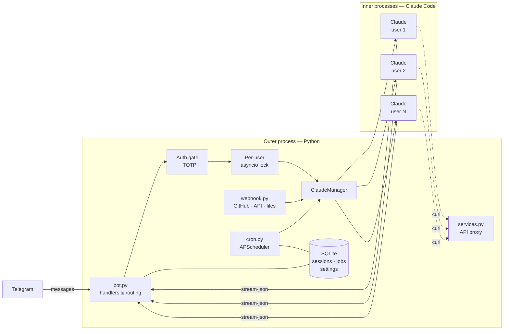
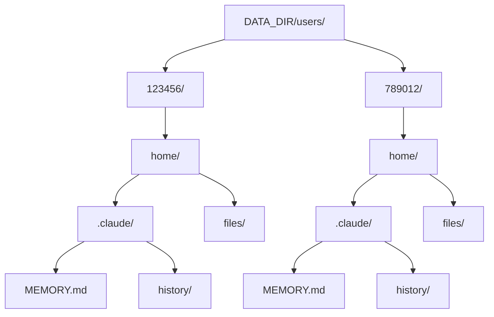

# Kai

[](https://github.com/dcellison/kai/actions/workflows/ci.yml)
[](https://python.org)
[](LICENSE)
[](https://github.com/dcellison/kai/releases)

An AI agent, not a chatbot. Kai wraps a persistent [Claude Code](https://docs.anthropic.com/en/docs/claude-code) process running on your hardware and connects it to Telegram as a control surface. Shell, filesystem, git, web search, scheduling - the agent has real access to your system and can take real action on it. It reviews PRs when code is pushed, triages issues when they're opened, monitors conditions on a schedule, and operates across any project on your machine.

For detailed guides on setup, architecture, and optional features, see the **[Wiki](https://github.com/dcellison/kai/wiki)**.

## Architecture

Kai is two processes: an outer Python application that handles Telegram, HTTP, and scheduling, and an inner Claude Code subprocess that does the thinking and acting. The outer process manages lifecycle, authentication, and transport. The inner process has persistent state, tool access, and a working directory on your filesystem.

This is what separates Kai from API-wrapper bots that send text to a model endpoint and relay the response. Claude Code is a full agentic runtime - it reads files, runs shell commands, searches the web, writes and commits code, and maintains context across a session. Kai gives that runtime a durable home, a scheduling system, event-driven inputs, persistent memory, and a security model designed around the fact that it has all of this power.

Everything runs locally. Conversations never transit a relay server. Voice transcription and synthesis happen on-device. API keys are proxied through an internal service layer so they never appear in conversation context. There is no cloud component between you and your machine.



Three entry points (Telegram, Webhooks, Cron) feed the outer process, which spawns per-user Claude subprocesses. Responses stream back via JSON. The services proxy is an optional internal endpoint.

## Multi-user isolation

Each authorized user gets an independent Claude Code subprocess and a fully siloed data directory. No state is shared between users.

| Resource | Scope | Mechanism |
|---|---|---|
| Claude process | One per user | `ClaudeManager` spawns/tracks by `user_id` |
| Home directory | `DATA_DIR/users/{user_id}/home/` | Created on first message |
| Conversation history | `home/.claude/history/` | Per-user JSONL logs |
| Memory | `home/.claude/MEMORY.md` | Isolated persistent context |
| SQLite rows | Keyed by `user_id` | Sessions, settings, jobs partitioned per user |
| Asyncio lock | One per user | Concurrent users never block each other |
| Stop event | One per user | `/stop` only interrupts your own session |
| Crash recovery | Per user | Restart notification targets the affected user |
| TOTP session | Per user | Auth timeout tracked independently |
| Scheduled jobs | Per user | Jobs execute in the owning user's subprocess |



## Security model

Giving an AI agent shell access is a real trust decision. Kai's approach is layered defense - each layer independent, so no single failure is catastrophic:

- **Telegram auth** - only explicitly whitelisted user IDs can interact. Unauthorized messages are silently dropped before reaching any handler.
- **TOTP gate** (optional) - two-factor authentication via time-based one-time passwords. After a configurable idle timeout, Kai requires a 6-digit authenticator code before processing anything. The secret lives in a root-owned file (mode 0600) that the bot process cannot read directly; it verifies codes through narrowly-scoped sudoers rules. Even if someone compromises your Telegram account, they can't use your assistant without your authenticator device. Rate limiting with disk-persisted lockout protects against brute force.
- **Process isolation** - authentication state lives in the bot's in-memory context, not in the filesystem or conversation history. The inner Claude process cannot read, manipulate, or bypass the auth gate.
- **Path confinement** - file exchange operations are restricted to the active workspace via `Path.relative_to()`. Traversal attempts are rejected.
- **Service proxy** - external API keys live in server-side config (`services.yaml`) and are injected at request time. Claude calls APIs through a local proxy endpoint; the keys never enter the conversation.

Setup for TOTP requires the optional dependency group and root access:

```bash
pip install -e '.[totp]'             # adds pyotp and qrcode
sudo python -m kai totp setup        # generate secret, display QR code, confirm
```

For the full architecture, see [System Architecture](https://github.com/dcellison/kai/wiki/System-Architecture). For TOTP details, see [TOTP Authentication](https://github.com/dcellison/kai/wiki/TOTP-Authentication).

## Features

### Workspaces

Switch the agent between projects on your system with `/workspace <name>`. Names resolve relative to `WORKSPACE_BASE` (set in `.env`). Identity and memory carry over from the home workspace, so Kai retains full context regardless of what it's working on. Create new workspaces with `/workspace new <name>`. Absolute paths are not accepted - all workspaces must live under the configured base directory.

Per-workspace configuration is supported via `workspaces.yaml` (or `/etc/kai/workspaces.yaml` for protected installations). Each workspace can override the Claude model, budget, timeout, environment variables, and system prompt. See `workspaces.example.yaml` for the full format.

### Memory

Three layers of persistent context give the agent continuity across sessions:

1. **Auto-memory** - managed by Claude Code per-workspace. Project architecture and patterns.
2. **Home memory** (`workspace/.claude/MEMORY.md`) - personal memory, always injected regardless of current workspace. Proactively updated by Kai.
3. **Conversation history** (`workspace/.claude/history/`) - JSONL logs, one file per day. Searchable for past conversations.

Foreign workspaces also get their own `.claude/MEMORY.md` injected alongside home memory. See [System Architecture](https://github.com/dcellison/kai/wiki/System-Architecture).

### Scheduled jobs

Reminders and recurring agent jobs with one-shot, daily, and interval schedules. Ask naturally ("remind me at 3pm") or use the HTTP API (`POST /api/schedule`). Agent jobs run as full Claude Code sessions - Kai can check conditions, search the web, run commands, and report back on a schedule. Auto-remove jobs support monitoring use cases where the agent watches for a condition and deactivates itself when it's met. See [Scheduling and Conditional Jobs](https://github.com/dcellison/kai/wiki/Scheduling-and-Conditional-Jobs).

### PR Review Agent

When code is pushed to a pull request, Kai automatically reviews it. A one-shot Claude subprocess analyzes the diff, checks for bugs, style issues, and spec compliance, and posts a review comment directly on the PR. If you push fixes, it reviews again - and checks its own prior comments so it doesn't nag about things you already addressed. See [PR Review Agent](https://github.com/dcellison/kai/wiki/PR-Review-Agent).

### Issue Triage Agent

When a new issue is opened, Kai triages it automatically. A one-shot Claude subprocess reads the issue, applies labels (creating them if they don't exist), checks for duplicates and related issues, assigns it to a project board if appropriate, posts a triage summary comment, and sends you a Telegram notification. See [Issue Triage Agent](https://github.com/dcellison/kai/wiki/Issue-Triage-Agent).

Both agents are fire-and-forget background tasks that run independently of your chat session. They use separate Claude processes, so a review or triage can happen while you're mid-conversation. Opt-in via `PR_REVIEW_ENABLED` and `ISSUE_TRIAGE_ENABLED` in `.env`.

### Webhooks

An HTTP server receives external events and routes them to the agent. GitHub webhooks (pushes, PRs, issues, comments, reviews) are validated via HMAC-SHA256. A generic endpoint (`POST /webhook`) accepts JSON from any service - CI pipelines, monitoring alerts, deployment hooks, anything that can POST JSON. See [Exposing Kai to the Internet](https://github.com/dcellison/kai/wiki/Exposing-Kai-to-the-Internet).

### File exchange

Send any file type directly in chat - photos, documents, PDFs, archives, anything. Files are saved to a `files/` directory inside the active workspace with timestamped names, and the agent gets the path so it can work with them via shell tools. Kai can also send files back to you through the internal API. Images render inline; everything else arrives as a document attachment.

### Streaming responses

Responses stream into Telegram in real time, updating the message every 2 seconds.

### Model switching

Switch between Opus, Sonnet, and Haiku via `/models` (interactive picker) or `/model <name>` (direct). Changing models restarts the session.

### Voice input

Voice notes are transcribed locally using [whisper.cpp](https://github.com/ggerganov/whisper.cpp) and forwarded to the agent. Requires `ffmpeg` and `whisper-cpp`. Disabled by default - set `VOICE_ENABLED=true` after installing dependencies. See the [Voice Setup](https://github.com/dcellison/kai/wiki/Voice-Setup) wiki page.

### Voice responses (TTS)

Text-to-speech via [Piper TTS](https://github.com/rhasspy/piper). Three modes: `/voice only` (voice note, no text), `/voice on` (text + voice), `/voice off` (text only, default). Eight curated English voices. Requires `pip install -e '.[tts]'` and `TTS_ENABLED=true`. See [Voice Setup](https://github.com/dcellison/kai/wiki/Voice-Setup).

### Dual-mode Telegram transport

Kai supports two ways of receiving Telegram updates: **long polling** (default) and **webhooks**. Polling works out of the box behind NAT with zero infrastructure. Set `TELEGRAM_WEBHOOK_URL` in `.env` to switch to webhook mode for lower latency - this requires a tunnel or reverse proxy (see [Exposing Kai to the Internet](https://github.com/dcellison/kai/wiki/Exposing-Kai-to-the-Internet)).

### Crash recovery

If interrupted mid-response, Kai notifies you on restart and asks you to resend your last message.

## Commands

| Command | Description |
|---|---|
| `/new` | Clear session and start fresh |
| `/stop` | Interrupt a response mid-stream |
| `/models` | Interactive model picker |
| `/model <name>` | Switch model (`opus`, `sonnet`, `haiku`) |
| `/workspace` | Show current workspace |
| `/workspace <name>` | Switch by name (resolved under `WORKSPACE_BASE`) |
| `/workspace home` | Return to default workspace |
| `/workspace new <name>` | Create a new workspace with git init |
| `/workspaces` | Interactive workspace picker |
| `/voice` | Toggle voice responses on/off |
| `/voice only` | Voice-only mode (no text) |
| `/voice on` | Text + voice mode |
| `/voice <name>` | Set voice |
| `/voices` | Interactive voice picker |
| `/stats` | Show session info, model, and cost |
| `/jobs` | List active scheduled jobs |
| `/canceljob <id>` | Cancel a scheduled job |
| `/webhooks` | Show webhook server status |
| `/notifications` | Toggle GitHub/webhook notification preferences |
| `/help` | Show available commands |

## Requirements

- Python 3.13+
- [Claude Code CLI](https://docs.anthropic.com/en/docs/claude-code) installed and authenticated
- A Telegram bot token from [@BotFather](https://t.me/BotFather)
- Your Telegram user ID (get it from [@userinfobot](https://t.me/userinfobot))

## Setup

```bash
git clone git@github.com:dcellison/kai.git
cd kai
python3 -m venv .venv
source .venv/bin/activate
pip install -e '.[dev]'
cp .env.example .env
```

### Environment variables

| Variable | Required | Default | Description |
|---|---|---|---|
| `TELEGRAM_BOT_TOKEN` | Yes | | Bot token from BotFather |
| `ALLOWED_USER_IDS` | Yes | | Comma-separated Telegram user IDs |
| `CLAUDE_MODEL` | No | `sonnet` | Default model (`opus`, `sonnet`, or `haiku`) |
| `CLAUDE_TIMEOUT_SECONDS` | No | `120` | Per-message timeout |
| `CLAUDE_MAX_BUDGET_USD` | No | `10.0` | Session budget cap |
| `WORKSPACE_BASE` | No | | Base directory for workspace name resolution |
| `ALLOWED_WORKSPACES` | No | | Comma-separated absolute paths accessible as workspaces outside `WORKSPACE_BASE` |
| `WEBHOOK_PORT` | No | `8080` | HTTP server port for webhooks and scheduling API |
| `WEBHOOK_SECRET` | No | | Secret for webhook validation and scheduling API auth |
| `TELEGRAM_WEBHOOK_URL` | No | | Telegram webhook URL (enables webhook mode; omit for polling) |
| `TELEGRAM_WEBHOOK_SECRET` | No | | Separate secret for Telegram webhook auth (defaults to `WEBHOOK_SECRET`) |
| `PR_REVIEW_ENABLED` | No | `false` | Enable automatic PR review on push |
| `ISSUE_TRIAGE_ENABLED` | No | `false` | Enable automatic issue triage on open |
| `VOICE_ENABLED` | No | `false` | Enable voice message transcription |
| `TTS_ENABLED` | No | `false` | Enable text-to-speech voice responses |
| `TOTP_SESSION_MINUTES` | No | `30` | Minutes before TOTP re-authentication is required |
| `TOTP_CHALLENGE_SECONDS` | No | `120` | Seconds the code entry window stays open |
| `TOTP_LOCKOUT_ATTEMPTS` | No | `3` | Failed TOTP attempts before temporary lockout |
| `TOTP_LOCKOUT_MINUTES` | No | `15` | TOTP lockout duration in minutes |
| `CLAUDE_USER` | No | | OS user for the inner Claude process (enables process isolation via `sudo -u`) |

`CLAUDE_MAX_BUDGET_USD` limits how much work Claude can do in a single session via Claude Code's `--max-budget-usd` flag. On Pro/Max plans this is purely a runaway prevention mechanism (no per-token charges). The session resets on `/new`, model switch, or workspace switch.

## Running

```bash
make run
```

Or manually: `source .venv/bin/activate && python -m kai`

### Running as a service (macOS)

Create `~/Library/LaunchAgents/com.kai.bot.plist`:

```xml
<?xml version="1.0" encoding="UTF-8"?>
<!DOCTYPE plist PUBLIC "-//Apple//DTD PLIST 1.0//EN" "http://www.apple.com/DTDs/PropertyList-1.0.dtd">
<plist version="1.0">
<dict>
    <key>Label</key>
    <string>com.kai.bot</string>

    <key>ProgramArguments</key>
    <array>
        <string>/path/to/kai/.venv/bin/python</string>
        <string>-m</string>
        <string>kai</string>
    </array>

    <key>WorkingDirectory</key>
    <string>/path/to/kai</string>

    <key>EnvironmentVariables</key>
    <dict>
        <key>PATH</key>
        <string>/opt/homebrew/bin:/usr/local/bin:/usr/bin:/bin</string>
    </dict>

    <key>RunAtLoad</key>
    <true/>

    <key>KeepAlive</key>
    <true/>

    <key>ProcessType</key>
    <string>Background</string>
</dict>
</plist>
```

Replace `/path/to/kai` with your actual project path. The `PATH` must include directories for `claude`, `ffmpeg`, and any other tools Kai shells out to.

```bash
launchctl load ~/Library/LaunchAgents/com.kai.bot.plist
```

Kai will start immediately and restart automatically on login or crash. Logs go to `logs/kai.log` with daily rotation (14 days of history). To stop:

```bash
launchctl unload ~/Library/LaunchAgents/com.kai.bot.plist
```

### Running as a service (Linux)

Create `/etc/systemd/system/kai.service`:

```ini
[Unit]
Description=Kai Telegram Bot
After=network-online.target
Wants=network-online.target

[Service]
Type=simple
User=YOUR_USERNAME
WorkingDirectory=/path/to/kai
ExecStart=/path/to/kai/.venv/bin/python -m kai
Restart=always
RestartSec=5
Environment=PATH=/usr/local/bin:/usr/bin:/bin

[Install]
WantedBy=multi-user.target
```

Replace `YOUR_USERNAME` and `/path/to/kai` with your values. Add any extra directories to `PATH` where `claude`, `ffmpeg`, etc. are installed.

The `network-online.target` dependency ensures systemd waits for network connectivity before starting Kai, preventing DNS failures during boot.

```bash
sudo systemctl enable kai
sudo systemctl start kai
```

Check logs with `tail -f logs/kai.log` or `journalctl -u kai -f`. To stop:

```bash
sudo systemctl stop kai
```

## Project Structure

```
kai/
├── src/kai/                  # Source package
│   ├── __init__.py           # Version
│   ├── __main__.py           # python -m kai entry point
│   ├── main.py               # Async startup and shutdown
│   ├── bot.py                # Telegram handlers, commands, message routing
│   ├── claude.py             # Persistent Claude Code subprocess management
│   ├── config.py             # Environment and per-workspace config loading
│   ├── sessions.py           # SQLite session, job, and settings storage
│   ├── cron.py               # Scheduled job execution (APScheduler)
│   ├── webhook.py            # HTTP server: GitHub/generic webhooks, scheduling API
│   ├── history.py            # Conversation history (read/write JSONL logs)
│   ├── locks.py              # Per-chat async locks and stop events
│   ├── install.py            # Protected installation tooling
│   ├── totp.py               # TOTP verification, rate limiting, and CLI
│   ├── review.py             # PR review agent (one-shot Claude subprocess)
│   ├── triage.py             # Issue triage agent (one-shot Claude subprocess)
│   ├── services.py           # External service proxy for third-party APIs
│   ├── transcribe.py         # Voice message transcription (ffmpeg + whisper-cpp)
│   └── tts.py                # Text-to-speech synthesis (Piper TTS + ffmpeg)
├── tests/                    # Test suite
├── workspace/                # Template workspace (copied to per-user dirs on first access)
│   └── .claude/              # CLAUDE.md template, MEMORY.md.example
├── users/                    # Per-user data (gitignored, created at runtime)
├── kai.db                    # SQLite database (gitignored, created at runtime)
├── logs/                     # Daily-rotated log files (gitignored)
├── models/                   # Whisper and Piper model files (gitignored)
├── services.yaml             # External service configs (gitignored)
├── workspaces.example.yaml   # Per-workspace config template
├── pyproject.toml            # Package metadata and dependencies
├── Makefile                  # Common dev commands
├── .env                      # Environment variables (gitignored, copy from .env.example)
└── LICENSE                   # Apache 2.0
```

## Development

```bash
make setup      # Install in editable mode with dev tools
make lint       # Run ruff linter
make format     # Auto-format with ruff
make check      # Lint + format check (CI-friendly)
make test       # Run test suite
make run        # Start the bot
```

## Production deployment

For a hardened installation that separates source, data, and secrets across protected directories:

```bash
python -m kai install config       # Interactive Q&A, writes install.conf (no sudo)
sudo python -m kai install apply   # Creates /opt layout, migrates data (root)
python -m kai install status       # Shows current installation state (no sudo)
```

This creates a split layout:

- `/opt/kai/` - read-only source and venv (root-owned)
- `/var/lib/kai/` - writable runtime data: database, logs, files (service-user-owned)
- `/etc/kai/` - secrets: env file, service configs, TOTP (root-owned, mode 0600)

The install module handles directory creation, source copying, venv setup, secret deployment, sudoers rules, data migration, service definition generation, and service lifecycle (stop/start). Use `--dry-run` to preview changes without applying them.

The service user reads secrets via narrowly-scoped sudoers rules (`sudo cat` on specific files only). The inner Claude process cannot read secrets or modify source code.

## License

Apache License 2.0. See [LICENSE](LICENSE) for details.
